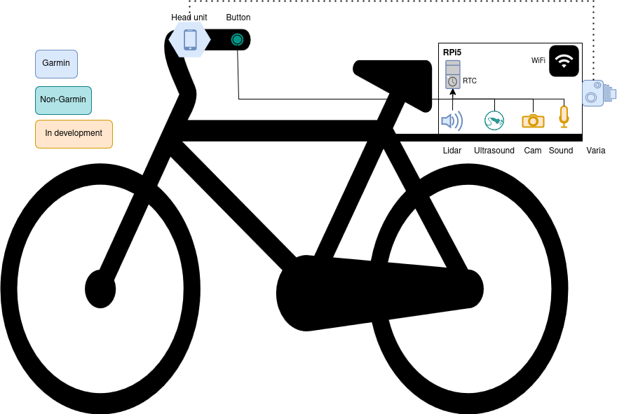

# TrafficLogger

We developed a portable, modular data logger with the primary purpose of logging various variables for overtaking and oncoming vehicles on rural roads. The ambition is to keep the equipment flexible, such that it can also be deployed in other environments and with other purposes. 

