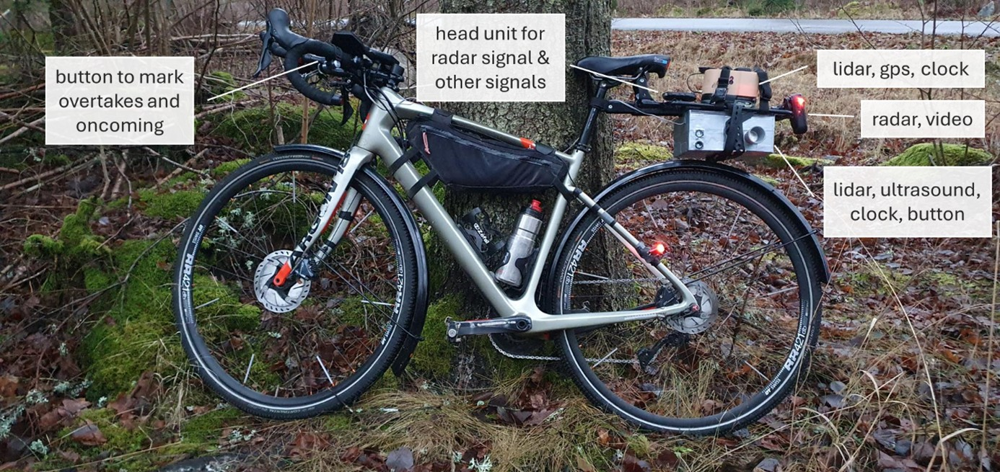
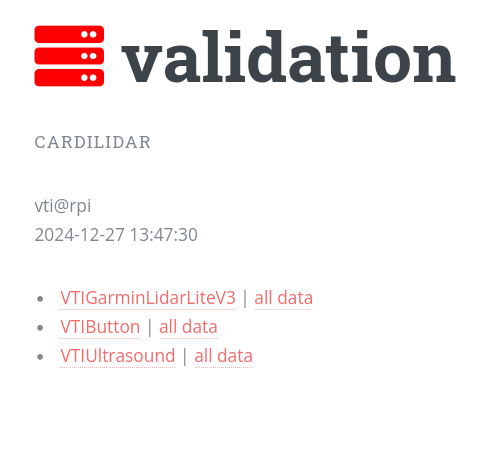
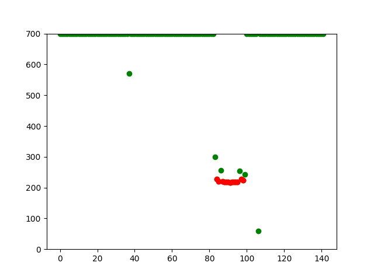

# TrafficLogger

We developed a portable, modular data logger with the primary purpose of logging various variables for overtaking and oncoming vehicles on rural roads. The ambition is to keep the equipment flexible, such that it can also be deployed in other environments and with other purposes.

{:style="display:block; margin-left:auto; margin-right:auto; width:80%"}

## Mount

Currently the equipment is mounted on a rack that is attached to the seat post and seat rails to fit most bikes. It can also be modified to fit other so-called micromobility devices such as e-scooters. The equipment together with the rack weighs slightly over 1 kg and will in its final shape not be very conspicuous.

*A bicycle with the rack and both prototypes attached. The grey cable leads to the handlebars, where the marker button is attached.*

## Logger unit

The core consists of a Raspberry Pi with several sensors attached to it.

### Raspberry Pi

We have one prototype with each of Raspberry Pi 4 (B), Raspberry Pi Zero 2 (W), and Raspberry Pi 5 (8GB RAM) and they run some flavor of Pi-intended linux (PiOS, etc.). The Raspberry Pi platform was favored for this project because it is small, uses very little power, is cheap, and is still a fully capable computer.

### Lidar

We are testing two lidars. One is [Garmin Lidar Lite V3](https://www.garmin.com/en-US/p/557294) , the other is [SmartFly Tech TFmini-s](https://www.amazon.se/TFmini-s-Lidar-sensor-m%C3%A4tavst%C3%A5ndsavst%C3%A5nd-avst%C3%A5ndsm%C3%A4tare-Finder-modul/dp/B08F54BDCF/ref=sr_1_1?crid=1UO2TVF4REFE9&dib=eyJ2IjoiMSJ9.kxWupG-8HhWolgBXTFrN9mE4Ooq3TJe2WjSCXugzfJ94Iw2_wmsOFiaivPfUwsGrif02T3LtDi4jrRKJ-6JGH9-8B4a3sf8ESTpm4tPkoasn7VVqo1oC4qqfbTas24N-IvRUzKp1rYCe0Pytkjn5Th6sdihA3TH5nsvjNv5qTEI3F7zho2cSzKjZsTAx7m_ypimMMihDy1rdvVmrOkyQFWa1S7BZPOLx0ghopP0C4gpsCi9uTnDK0lOGF0i2bxBnJKNSp3U0bxQ8xnWq8xzmVhi2wGyzfJJYTjsWTEUwQOs.y2C5cEiOtpe4x1nnI6vL9KVP3tQW2CP-PTwT61HgCgQ&dib_tag=se&keywords=tfmini+s+lidar+raspberry+pi&qid=1727805223&sprefix=tfmini+s+lida+raspberry+pi%2Caps%2C118&sr=8-1).

### Ultrasound

The key is to use one with adaptive signal frequency. There is a maximum range associated with each frequency as the sound only travels so far in each fraction of a second. Therefore, any fixed frequency limits the range and takes fewer than possible number of readings at close range. Sending a new signal as soon as we took the previous reading guarantees that the sensor is operating at maximum possible frequency for each range (with some little time taken for calculations).

There are two limitations that we need to keep in mind. One is the relatively low achievable signal frequency at the higher end of the range (towards 7m) due to relatively low speed of sound which needs to travel there and back before a new signal is sent out. The other is noisy readings at low range and high frequency because the previous signal has not had enough time to dissipate before the next reading is taken. The former is just a general limitation of ultrasound technique. The latter turns out not to be problematic when the ultrasound device is mounted on a moving bike which does not echo signal too much, as it is not a smooth surface.

We are using [MB7040 I2CXL-MaxSonar-WR × 1 (-1XX) 3/4" NPS WR Housing with Fluorosilicone Option (IP68)](https://maxbotix.com/products/mb7040?srsltid=AfmBOopepljpQLy7WviOqEFzuTJe7vOrnPzTp-pt73glzub6seSId8Zq).

### GPS
[Waveshare L76X GPS HAT](https://www.waveshare.com/wiki/L76X_GPS_HAT) and an external antenna. Aside from the positioning information, real time clock (RTC) is one of the added benefits of the GPS when combined with Raspberry Pi Zero.

### Button

A small push button is attached to the Raspberry Pi via cable, such that it can be mounted on the handlebars. It can be used to mark events, like overtakes or oncoming vehicles, or any other event, depending on the research question.

### Camera

Not yet installed.

A planned feature is a camera pointing in the same direction as the sensor that is triggered when the sensor registers a dip in the lateral distance.

### Microphone

Not yet installed.

A planned feature is a microphone to log noise level and to potentially identify overtaking and oncoming traffic.

## Head Unit

To log radar data, a Garmin head unit is used. The Garmin ConnectIQ app [MyBikeTraffic](https://www.mybiketraffic.com/) was downloaded and installed according to the instructions. This way, radar data is displayed on the screen of the head unit and stored in the FIT file on the head unit.

According to information on that site, it should also be possible to log radar with the “Cadence Running and Cycling App” for Android and iPhone, but we have not tested that setup.

The head unit also logs information like GPS, cyclist speed, elevation, etc., and can log any other data for which sensors can be coupled to the head unit, such as cadence, power, heart rate, etc.

## Radar

A Garmin Varia 760 is used as part of the logging equipment. It is paired with the head unit via ANT+. It is mounted on the rear of the rack holding the logger unit, such that it has a free field of view to vehicles approaching from behind. When connected to the companion app, it can be set to either have the rear light on or off, and to record continuous video, to record only when an approaching vehicle is detected, or to not record video at all.

## Sync

The TrafficLogger is a fully capable computer, including wi-fi connectivity. They are all configured to automatically connect to a `bicycledata` network when available, e.g. a hotspot via the rider’s phone. Whenever connected, data is pushed to the server https://bicycledata.vti.se/ and resides there. It is accessible from the browser as any other website, provided the user has a valid authorization token.

{:style="display:block; margin-left:auto; margin-right:auto"}

<i>View of the server interface. Two files for each of the sensors: last 5s preview and a full file.</i>

When a TrafficLogger device turns on (when connected to a power source), it executes a start-up script which connects to the same server and pulls config information. If there are changes, they are immediately used. If there is no internet connectivity, the locally available config is respected.

In other words, TrafficLogger is updatable and configurable provided that it is connected to the internet – which is true whenever it is turned on and the `bicycledata` network is available to it.

NOTE: Raspberry Pi 5 features a real-time clock, and we provided it with a coin battery, so it stays on even when the computer is off. This way the timestamps in the data are always in sync with real time.

## Backend

The invisible work consists of a few software pieces. The GitHub space dedicated to this project is [bicycledata](https://github.com/bicycledata) with the summary being at [bicycledata/docs](https://bicycledata.github.io/docs/)

- Server side: [https://bicycledata.vti.se]()(*) as code at [bicycledata/bicycledata](https://github.com/bicycledata/bicycledata)
- Initialization scripts: [bicycledata/bicycleinit](https://github.com/bicycledata/bicycleinit)
- Sensor template: [bicycledata/sensor_template](https://github.com/bicycledata/sensor_template)
- Sensor implementations
    - [bicyclelidar](https://github.com/bicycledata/bicyclelidar)
    - [bicyclegps](https://github.com/bicycledata/bicyclegps)
    - [jsliacan/sensors](https://github.com/jsliacan/sensors)

(*) the domain listed here is not live yet, we are still in the process of migrating the server to it.

The server side implements a flask web app which keeps and makes accessible information governing TrafficLoggers and data collected by them. The initialization script takes care of keeping the TrafficLogger (RPi) in sync with the server side and initializing the TrafficLogger with the latest available config, waking up sensors and leaving them in operation, collecting data. And sensor control scripts provide modular control of sensors attached to the RPi (any change to these will be picked up at the next online start of the TrafficLogger). These scripts control what sensors do when they are read/accessed.

## Logging Overtaking/Oncoming traffic

The radar, the head unit and one of the boxes need to be mounted either with the rack used here or in another way. The radar needs a free view rearward, and the log box must have the sensor pointing to the left. The button needs to be easily reachable by the operator. All three devices must be switched on separately. Make sure that the radar connects to the head unit.

Overtaking and oncoming vehicles are identified via the marker button. The current standard is to press the button once briefly (well below 1 s duration) to mark an oncoming vehicle. The press is made while the oncoming vehicle is still in front, fully visible to the cyclist.

Overtaking vehicles are currently marked by a longer button press, at least 1 s in duration. Also here, the button is pressed when the vehicle is visible in front of the cyclist. As a rule of thumb, the press should be made after the cyclist has been passed, when the registration plate is already visible.

This button pressing pattern has redundant information – press length and timing of the press in relation to the dip in the lateral distance signal. For oncoming traffic, the dip occurs after the button press, whereas for overtaking traffic the dip occurs before the button press.

The current procedure is to mark traffic only when there are no physical barriers between the cyclist and other traffic, but of course this depends on the research question.

## Data Processing

### Lateral distances
In this case, dta processing mainly consists of our *event detection* method. We rely on the rider long-pressing a button immediately after every overtake and short-pressing it immediately before each oncoming vehicle. This way we know to focus our search to a very contained interval of lateral distance data, making it easier to avoid false positive detections. Once we identify short time window like that, we reset all out-of-bounds and erroneous readings to a set value higher than the road width. At this point the task is to identify a continuous subsequence of lateral distance values that correspond to the readings when the signal reflected from the oncoming/overtaking vehicle. We do this in 3 steps.

1. Identify sub-average values. Our overtake/oncoming readings will be among those.
2. Use Louvain algorithm for community detection, based on the modularity function, to identify "communities" in in the graph G that we carefully constructed from the sequence of sub-average lateral distance values.
3. To the resulting maximum community, we apply max-clique filter together with re-attachment process for the vertices connected to the clique in a sufficient manner.

{:style="display:block; margin-left:auto; margin-right:auto"}

<i>Example of an auto-detected overtaking event from real data. Selected event is in red.</i>

### Speed

Approaching vehicle speeds come from the head unit FIT file, where Varia radar data is saved. The frequency is 1Hz. We are able to obtain and extract all the radar data that is available this way. Rada information does not directly give passing speeds. They can, however, be estimated from the approach speeds. However, the frequency of the radar data is low and the vehicle speed is distorted when the vehicle travels to the next lane and is under angle (with respect to the radar). Due to these limitations, further work will be needed to obtain reliable information on overtaking/passing speeds.
